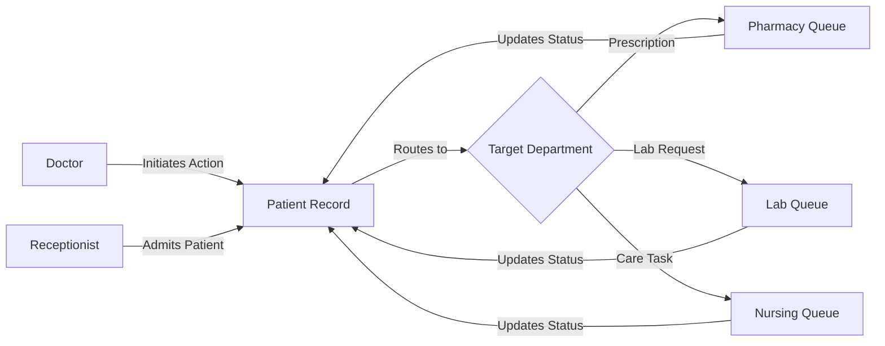

<p align="center">
  
  
  
  
</p>

# 🏥 Nexus — Patient-Centric Clinical Workflow System

> **Real-time visibility. Structured coordination. Zero communication gaps.**

Nexus is a **Patient-Centric Clinical Workflow and Coordination System (PCCWCS)** built for the **VNRVJIET AI-WEEK VIBE CODING HACKATHON (KRITHOMEDH)**. It tackles the #1 cause of preventable medical errors — **fragmented communication between hospital departments** — by unifying all clinical actions around a single, real-time patient record.

---

## 🔥 The Problem

In most hospitals today:
- 📋 Doctors write prescriptions on paper → Pharmacy receives them hours later
- 🧪 Lab results sit in a queue → the attending physician is never notified
- 🩺 Nurses implement care instructions → but no one tracks completion
- 🔄 Shift handoffs rely on verbal summaries → critical tasks get lost

**Result:** Delayed treatment, redundant tests, and patient safety risks.

---

## 💡 Our Solution

Nexus provides a **unified, role-based dashboard** where every clinical action — prescriptions, lab requests, nursing tasks — flows through a **real-time action pipeline** visible to all stakeholders.

| Before Nexus | After Nexus |
|---|---|
| Scattered paper trails | Single patient timeline |
| "Did pharmacy get my order?" | Live status: Pending → In-Progress → Completed |
| Verbal shift handoffs | Structured clinical notes with author logs |
| No task prioritization | Smart P1/P2/P3 priority queues |

---

## ✨ Key Features

### 🧑‍⚕️ Role-Based Dashboards
Five distinct interfaces, each optimized for the user's workflow:

| Role | Dashboard Highlights |
|---|---|
| **Doctor** | Patient list, pending requests, quick actions (Prescription, Diagnostic, Nursing, Notes) |
| **Nurse** | Priority-sorted care tasks, add custom tasks, mark completion |
| **Pharmacy** | Prescription queue with status pipeline |
| **Lab** | Diagnostic request queue with result updating |
| **Receptionist** | Patient admission form, full hospital census |

### 📊 Patient Record Dashboard
- **Clinical Action Timeline** — reverse-chronological feed of all actions for a patient
- **Color-coded status tags** — Pending (amber), In-Progress (blue), Completed (green)
- **Priority badges** — P1 Critical (red), P2 Urgent, P3 Routine
- **Quick Actions** — one-click Prescription, Diagnostic, Nursing, and Notes creation

### 📝 Clinical Notes with Author Logs
- Any role can add timestamped notes to a patient record
- Each note shows **author name**, **role badge**, and **relative timestamp**
- Full audit trail — who said what and when

### 🔄 Real-Time Departmental Coordination
- Doctor initiates action → appears instantly in the target department's queue
- Department updates status → reflected on the patient timeline
- Cross-departmental visibility — no action falls through the cracks

### 🏥 Patient Management
- Admit patients with severity classification (Critical / Urgent / Stable)
- Assign attending doctors
- Server-persisted patient records via REST API
- Allergy tracking and room assignment

---

## 🛠️ Tech Stack

| Layer | Technology | Why |
|---|---|---|
| **Framework** | Next.js 16 (App Router) | SSR, API routes, file-based routing |
| **Language** | TypeScript | Type safety across the stack |
| **UI Library** | shadcn/ui + Radix | Accessible, production-ready components |
| **Styling** | Tailwind CSS | Rapid prototyping with design consistency |
| **State** | React Context + Zustand pattern | Simple, performant global state |
| **Persistence** | Server-side JSON + localStorage | Dual-layer: API for patients, localStorage for actions |
| **Theming** | next-themes | Dark/Light mode toggle |

---

## 🚀 Quick Start

```bash
# 1. Clone the repo
git clone https://github.com/your-team/pccwcs.git
cd pccwcs

# 2. Install dependencies
npm install

# 3. Start development server
npm run dev
```

Open **[http://localhost:3000](http://localhost:3000)** and log in.

### 🔐 Demo Credentials

| Field | Value |
|---|---|
| **Username** | Any text (e.g., `doctor`, `nurse`) |
| **Password** | `pass123` |
| **Role** | Select from dropdown: Doctor, Nurse, Pharmacy, Lab, Receptionist |

> 💡 **Tip:** Each role redirects to its own dashboard. Try logging in as different roles to see the full system!

---

## 📁 Project Structure

```
src/
├── app/
│   ├── page.tsx              # Login page
│   ├── doctor/page.tsx       # Doctor dashboard
│   ├── nurse/page.tsx        # Nurse dashboard
│   ├── pharmacy/page.tsx     # Pharmacy queue
│   ├── lab/page.tsx          # Lab queue
│   ├── reception/page.tsx    # Reception & admissions
│   ├── patient/[id]/page.tsx # Patient record dashboard
│   └── api/patients/route.ts # REST API for patient persistence
├── components/
│   ├── patient/              # PatientHeader, ActionTimeline, QuickActions, NotesPanel
│   ├── doctor/               # PatientList, PendingRequests
│   ├── reception/            # PatientAdmissionForm
│   └── ui/                   # shadcn/ui primitives
└── lib/
    ├── store.tsx             # Global state management
    ├── types.ts              # TypeScript interfaces
    ├── mockData.ts           # Seed data for demo
    └── data/patients.json    # Server-persisted patient records
```

---

## 🏗️ Architecture



---

## 🎯 Hackathon Criteria Alignment

| Criteria | How We Address It |
|---|---|
| **Innovation** | Unified patient-centric workflow replacing fragmented paper-based systems |
| **Technical Complexity** | Role-based routing, real-time state sync, REST persistence, priority queuing |
| **UI/UX** | Dark mode, responsive design, color-coded priorities, micro-interactions |
| **Completeness** | 5 role dashboards, patient CRUD, clinical notes, action pipeline |
| **Real-World Impact** | Directly addresses WHO-identified causes of preventable medical errors |

---

## 👥 Team

Built with ❤️ for the **VNRVJIET AI-WEEK VIBE CODING HACKATHON (KRITHOMEDH)**

---

## 📄 License

MIT — free to use, modify, and distribute.
